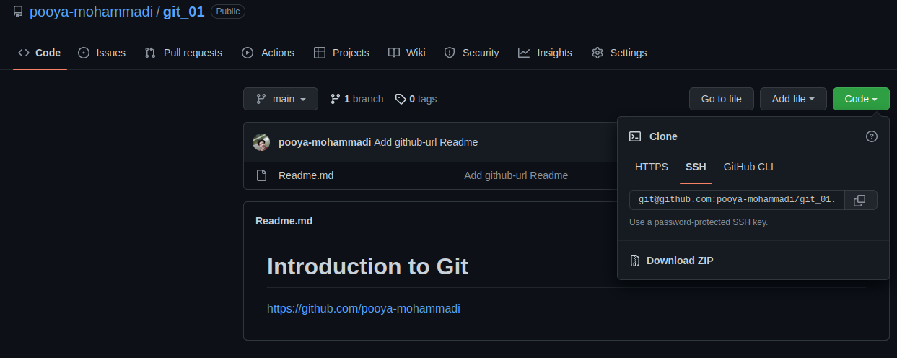
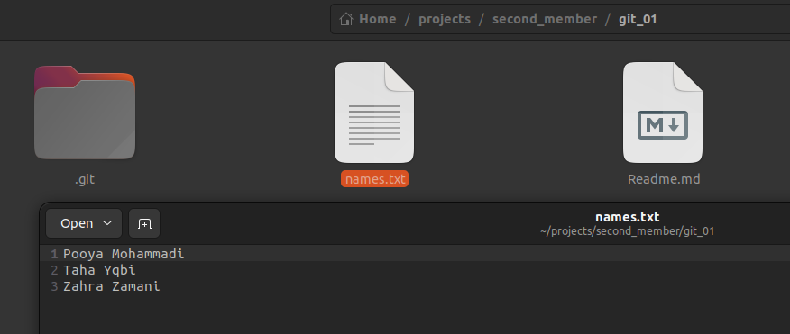
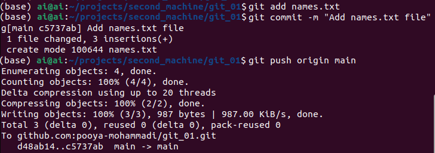
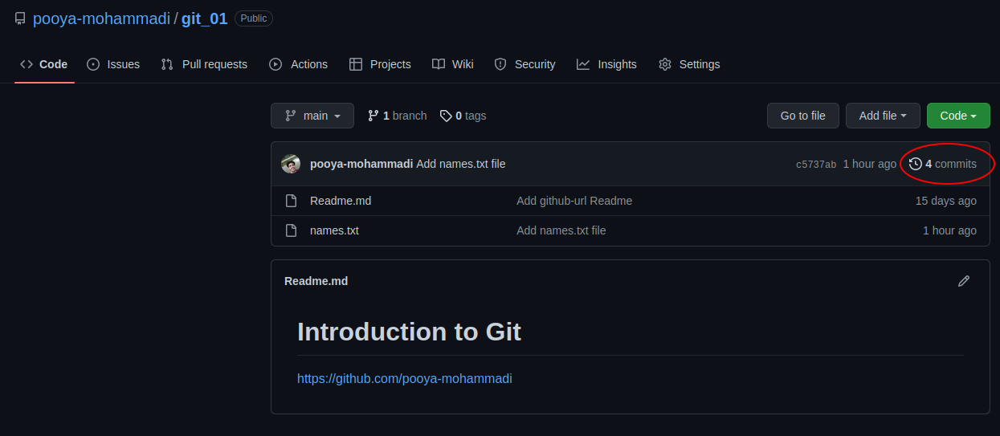
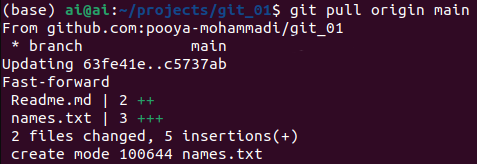
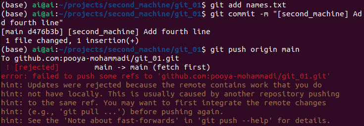
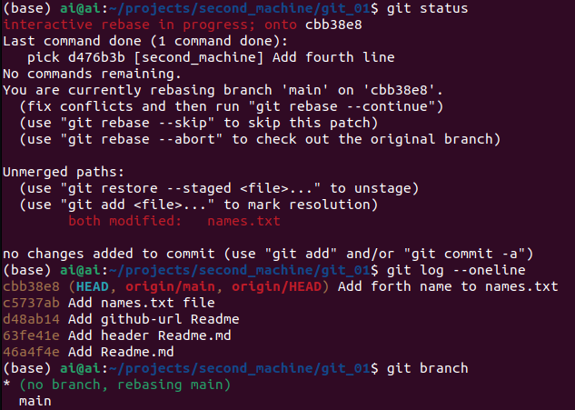
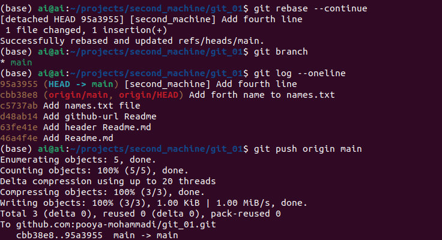

# Developing a project from different machines

It's a common need that git users may want to access to their projects from different machines/destinations. 
For instance, a student may want to work on a project using their laptop and a system in their campus.
Or a developer might have two operating systems, say Linux and Windows, thereby they need a way to sync their
codes and files without enduring severe suffering. In this tutorial we will focus on this issue. 
 
In this section, we will answer the following questions:
## Table of Content
1. [how to clone a project?](#how-to-clone-a-project)
2. [how to pull changes made from other git repositories?](#how-to-tackle-errors-and-conflicts-that-may-occur-in-this-way)
3. [how to tackle errors and conflicts that may occur in this way?](#how-to-tackle-errors-and-conflicts-that-may-occur-in-this-way)


## how to clone a project?
Before beginning this part, consider that you are working on a project and has created a GitHub repository.
To make the process easier, we will have two identical versions of our GitHub repository in two different destinations.

Now, let's get back to our first project that we created in the [cloning_remote_project section](https://github.com/pooya-mohammadi/intro_to_git/blob/main/creating_git_project.md). 
To clone a project we have two options as depicted in the following image:</br>
</br>
Options: HTTPS and SSH 

1. SSH:</br>
If you have [established ssh-connection with GitHub](https://github.com/pooya-mohammadi/intro_to_git/blob/main/creating_git_project.md#lets-assign-public-key-to-github), 
you can choose this option. Then simply copy the address appeared at the bar right below the SSH-button.

2. HTTPS: </br>
This is used when you don't have ssh-connection and simply want to authenticate each time you are making a change on the project.
Then, copy the address appeared at the bar right below the buttons.</br>

**Note:** If you want to clone a project which does not belong to you or your team members, and you simply want to check it without making any changes, you can use HTTPS or SSH.

For the sake of this tutorial, we shall clone the [git_01](https://github.com/pooya-mohammadi/git_01/) project
to a different directory to have two copies of it in two destinations in order to mimic two machines. 
This way, each destination will act as a separate machine.

To clone a project: 
```commandline
git clone <project-git-url>
```
In this tutorial, we'll clone the git_01 project with the following git-command:
```
mkdir second_machine # This may not work on Windows. Instead, create a new folder named second_machine
cd second_machine # change directory to second_git_01
git clone git@github.com:pooya-mohammadi/git_01.git # clone the project
```
**Note-1:** To follow with this tutorial, you have to use one of your own projects because you don't have proper permissions to make changes on [git_01](https://github.com/pooya-mohammadi/git_01/) repo.</br>
**Note-2:** Since I have established ssh-connection, I use the ssh-url for cloning the repository.</br>
**Note-3:** To become easily distinguished, another directory, named second_machine, is created. 

The output would be like the following:</br>


## how to pull changes made from other git repositories?
In this section, first, we will make a change on our newly cloned repo. Then, we will fetch/get/pull the changes 
from the [GitHub repository](https://github.com/pooya-mohammadi/git_01/) without making any direct connection to the 
local repository hosting the changes.

Let's create a simple change by adding a new text-file called `names.txt`. Then let's add a few names to it. 
The output should be like the following image:



Let's make a commit and send the changes to the remote server(in this case GitHub)
```commandline
git add names.txt # add the newly created/modified file to stage
git commit -m "Add names.txt file" # commit(get a snapshot) the staged files
git push origin main # push/send the commits to origin destination on the main branch(our GitHub repo)
```
The process of commands:



**NOTE:** I strongly encourage you guys to run `git status` command in any part of the process, so that you would get 
familiar with different stages of adding a project to git and GitHub repositories.

The output of GitHub repository should be like below:


### pull changes
So far, we added a txt file to our repo from the `second_machine/git_01` project. Consider these changes are made by 
a team member, and now you want to have these changes on your primary project/`git_01` and make your changes and so on. 

Now, let's compare the commit history of the primary project on our local machine(our system-Windows, Linux, Mac, and so on) 
with that of the GitHub repository:

First, local and primary project:</br>
```commandline
git log --oneline # to show the logs in oneline(easier to distinguish and comprehend)
```


To see commit history of a GitHub project click on the following button:</br>


The output should like below:


As it's evident from the two previous images, our main project is two commits behind from the GitHub repository.

**NOTE-1:** We made the last one an hour ago, and the one prior to that was made during the recording of the [YouTube 
video](https://youtu.be/X5EugV4hza0) of the previous tutorial on my Windows machine.</br>
**NOTE-2:** The first two commits are the same. Not only the commit messages, but also the commit hash codes are the same.

Now, let's pull the changes on our local machine:
```commandline
git pull origin main
```


As you can see in the image below, the names are exactly the same:


Now, we can make another group of changes, push them to GitHub, and pull them from other machine.

## how to tackle errors and conflicts that may occur in this way?

In this section, we'll try to mimic one the most common conflicts that a git user may occur while trying to sync codes from different machines.</br>
It happens when one forgets to `pull` the changes and make a commit on the same file that has been changed on another machine and pushed to GitHub. 

So, to have this conflict, let's add a new name to our `names.txt` file from our main repository and do the process of adding and pushing to GitHub repo.</br> 

```commandline
git add names.txt
git commit -m "Add fourth name to names.txt"
git push origin main
```

Now we have the changes on the git_01 repository on GitHub, but we haven't pulled them from second_machine/git_01.

Let's imagine that you go home from campus and immediately start coding without pulling the latest commits from GitHub repository.</br>
Trust me, it happens a lot. I make this mistake frequently.

So, let's change the same fourth line in the second_machine to a new name and try to add and push it without pulling the 
latest changes:</br>

```commandline
cd second_machine/git_01
git add names.txt
git commit -m "[second_machine] Add fourth name to names.txt"
git push origin main
```
The error message looks like the following:</br>


The hints are really helpful, I'll add them here as well.
>    To github.com:pooya-mohammadi/git_01.git
     ! [rejected]        main -> main (fetch first)
    error: failed to push some refs to 'github.com:pooya-mohammadi/git_01.git'
    hint: Updates were rejected because the remote contains work that you do
    hint: not have locally. This is usually caused by another repository pushing
    hint: to the same ref. You may want to first integrate the remote changes
    hint: (e.g., 'git pull ...') before pushing again.
    hint: See the 'Note about fast-forwards' in 'git push --help' for details.

So, let's pull the changes and see what happens:


This is where things get really devastating :facepalm:

Before we move on, let's recap:
1. We made a change on our main repository
2. We pushed it to GitHub
3. We made a change on the same file on the second_machine/git_01 repository without pulling first
4. We pushed our changes, the git refused. It said that the remove project contains work that ours does not have
5. We tried to pull the above-mentioned changes, but again the git refused because the local git has works that interferes with the work on GitHub.

Let's check the messages from Git itself:
``` 
remote: Enumerating objects: 5, done.
remote: Counting objects: 100% (5/5), done.
remote: Compressing objects: 100% (3/3), done.
Unpacking objects: 100% (3/3), 990 bytes | 990.00 KiB/s, done.
remote: Total 3 (delta 0), reused 3 (delta 0), pack-reused 0
From github.com:pooya-mohammadi/git_01
* branch            main       -> FETCH_HEAD
c5737ab..cbb38e8  main       -> origin/main
hint: You have divergent branches and need to specify how to reconcile them.
hint: You can do so by running one of the following commands sometime before
hint: your next pull:
hint: 
hint:   git config pull.rebase false  # merge (the default strategy)
hint:   git config pull.rebase true   # rebase
hint:   git config pull.ff only       # fast-forward only
hint: 
hint: You can replace "git config" with "git config --global" to set a default
hint: preference for all repositories. You can also pass --rebase, --no-rebase,
hint: or --ff-only on the command line to override the configured default per
hint: invocation.
fatal: Need to specify how to reconcile divergent branches.
```
**NOTE:** on Windows you might not see the previous message and realize that the default strategy
which is `merge` or `--no-rebase` is executed. If you want to reverse this behavior you can execute the following command
and follow the rest of the tutorial:
```commandline
git reset --hard HEAD
```

We have three options:

First:
```commandline
git pull origin main --rebase
```
In this one, our local changes/commits will be reapplied on top of the remote changes/commits.

Second:
```commandline
git pull origin main --merge
```
This will merge the remote changes with local ones, which will result in a merge commit. This may result in merge-conflict as well. 
We'll check this in future tutorials.

Third:
```commandline
git pull origin main --ff-only
```
This will apply the remote changes to local one only if they can be fast-forwarded. 
**Note:** In our case, this will be aborted.

So, Let's pull the changes with `rebase` feature. 
```commandline
git pull origin main --rebase
```


Another error-message. In this one, git says it's not able to merge the files because we made the same change on the same line of the same file, so
we have to resolve the conflicts manually.

**Note:** Most of the time, this is not the case and `rebase` would simply move the local commits on top of the remote ones.

Like always, let execute life-savor commands:</br>


So, a lot to explain:
1. Interactive rebase in progress. It means the git was not able to resolve the conflicts, thereby the rebasing process is not finished yet.
2. `names.txt`(the source of the conflict) is now modified. A question arises, what modified it? Because at the last step, we added it to stage and created a commit, so it shouldn't be modified!!!
3. The output of `git log --oneline` is also weird because the previous commit we made with "[second_machine] Add fourth name to names.txt" commit-message is gone.
4. Finally, a branch is changed to `rebasing main`, which is another indicator that rebasing it not finished.

So, let's check the `name.txt`:</br>


This explains a lot: 
```commandline
<<<<<<< HEAD
Hesam Edrisi
=======
```
This previous section means that this part `Hesam Edirsi` is taken from the HEAD which is on `Add forth name to names.txt`. It's part of the remote 
repository. 
```commandline
=======
Mohammad Mahdi
>>>>>>> d476b3b ([second_machine] Add fourth line)
```
This one means that is taken from our latest commit with `d476b3b` hash-code and `[second_machine] Add fourth line` commit message.</br>
This image puts everything into perspective. This is the sign of conflict. The git does not know which one should be saved, 
so it provides all the options for the user to decide. 

Let's resolve the conflict:</br>


For the sake of this tutorial, I saved the both names, but it's completely arbitrary and a user can resolve it in any way they desire.

Now, let's add and push the modified file:
```commandline
git add names.txt
git rebase --continue
```
It will ask you to provide a commit message you can accept the same commit message which was given by yourself in the previous section
or provide another one. In this example, I simply accepted the one we previously provided.

**NOTE:** Based on the default config of git, a `Vim` editor is opened for editing the commit message after executing `git rebase --continue`.
Following guide would help you while working `Vim`:
1. To start making a change enter button `i` in your keyboard. It stands for `insert`.
2. After you made your changes, enter button `Esc` on your keyboard. It exists the previous mode, which in our case is `i` or `insert`
3. To save and quit insert the following buttons `:wq`. `w` stands for `write` and `q` stands for `quit`.

Let's continue with the rest of the process:
```commandline
gir branch
git log --oneline
git push origin main
```


Now, everything is back to normal.
1. The conflicts are resolved
2. The rebase process is successfully continued and finished
3. branch is on `main`
4. the commits are in order(the remote commits always come first!)
5. the push works with no errors!

Let's see the output:</br>


As it's shown in the image the names are pushed to GitHub repo and the latest commit is like the one
on git-history shown in the previous image.

Final remarks:
1. This was one of the most common and also the most complex errors you may encounter while working on a project from different machines.
2. Most of the time, `rebase` automatically works when the changes are not made on the same file, and you wouldn't need to resolve conflicts manually, but in case if you have to, you know how to resolve it.
3. In real projects, you may have to resolve more than one file. The process is the same. You have to resolve all the conflicts on all the files.
